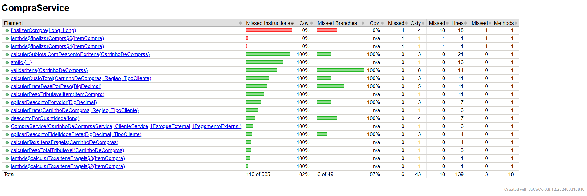
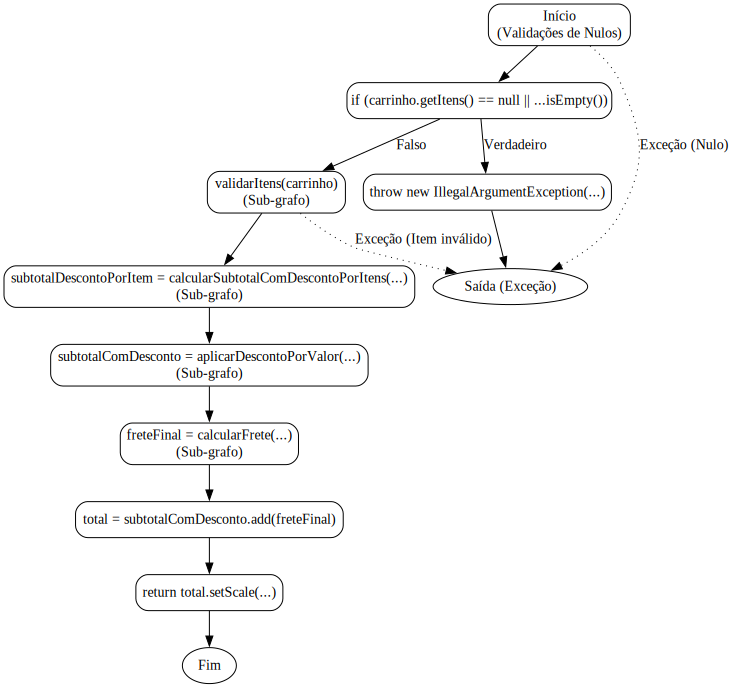
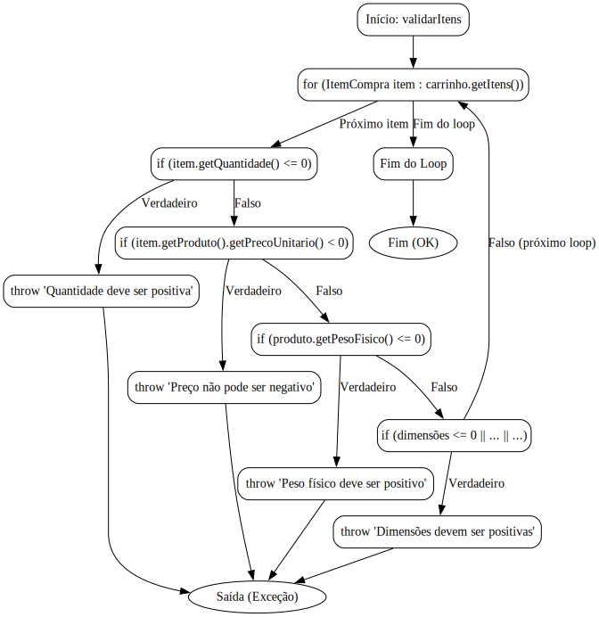
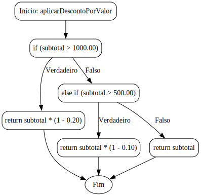
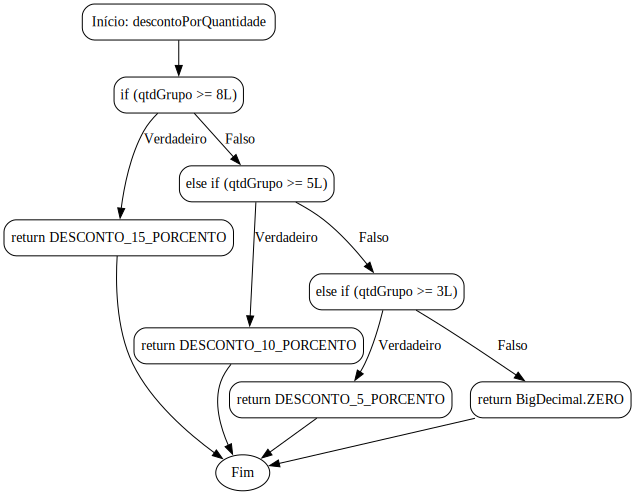
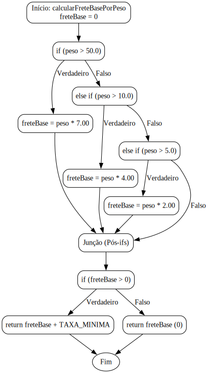
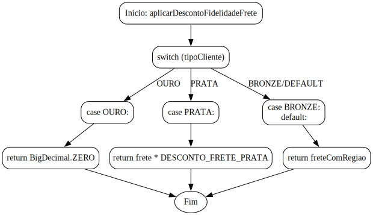

# Trabalho de Testes de Software - Finalizar Compra E-commerce

Este projeto contém a implementação dos testes de unidade automatizados, funcionais (caixa-preta) e estruturais (caixa-branca), para o método `calcularCustoTotal` do `CompraService` de uma aplicação de e-commerce. O objetivo é testar de forma isolada a lógica de cálculo de preço total da compra.

## Pré-requisitos

Para compilar o projeto e executar os testes, você precisará ter instalados em seu sistema:

* Java JDK (versão 17 ou superior)
* Apache Maven (versão 3.6 ou superior)

## Como Executar os Testes

Este é um projeto Maven e segue sua estrutura padrão. Todos os testes automatizados (JUnit 5) podem ser executados através do ciclo de vida padrão do Maven.

1.  Descompacte o arquivo `.zip` do projeto em um diretório de sua preferência.
2.  Abra um terminal (Prompt de Comando, PowerShell, Terminal, etc.).
3.  Navegue até o diretório raiz do projeto (a pasta que contém o arquivo `pom.xml`).
4.  Execute o seguinte comando:

    ```bash
    mvn test
    ```

Este comando irá baixar todas as dependências necessárias, compilar o código-fonte e, em seguida, compilar e executar todas as classes de teste localizadas em `src/test/java`.

Ao final da execução, o Maven exibirá um resumo no console, informando `BUILD SUCCESS` se todos os testes passarem, ou `BUILD FAILURE` se algum teste falhar.

## Como Verificar a Cobertura dos Testes

O projeto está configurado com o plugin **JaCoCo** para gerar relatórios de cobertura de código. A cobertura é avaliada durante a fase de teste.

1.  Execute o seguinte comando:

    ```bash
    mvn verify
    ```

2.  Após a execução bem-sucedida, o relatório de cobertura será gerado no seguinte diretório:

    `target/site/jacoco/`

3.  Abra o arquivo `index.html` em qualquer navegador web para visualizar o relatório de cobertura interativo.

4.  No relatório, navegue até o pacote `ecommerce.service` e clique em `CompraService` para inspecionar a cobertura detalhada do método `calcularCustoTotal`.

---

### Projeto de Testes e Análise Estrutural

A seguir, é apresentado o projeto de testes funcionais (caixa-preta) e a análise estrutural (caixa-branca) do método `calcularCustoTotal` e seus métodos auxiliares.

## Partições de Domínio

### Carinho de compras:

| Condição                                 | Valor | Partição |
| ---------------------------------------- | ----- | -------- |
| Carrinho é nulo                          | Sim   | **P1**   |
|                                          | Não   | **P2**   |
| Lista de produtos do carrinho está vazia | Sim   | **P3**   |
|                                          | Não   | **P4**   |

### Itens do Carrinho

| Condição                         | Valor | Partição |
| -------------------------------- | ----- | -------- |
| Quantidade do item > 0           | Sim   | **P5**   |
|                                  | Não   | **P6**   |
| Preço unitário do item ≥ 0       | Sim   | **P7**   |
|                                  | Não   | **P8**   |
| Peso físico do produto > 0       | Sim   | **P9**   |
|                                  | Não   | **P10**  |
| Todas as dimensões (C, L, A) > 0 | Sim   | **P11**  |
|                                  | Não   | **P12**  |
| O produto é frágil               | Sim   | **P13**  |
|                                  | Não   | **P14**  |


### Desconto por Quantidade de Itens do Mesmo Tipo:

| O tipo de cliente é BRONZE  | sim | p27 |
|-----------------------------|-----|-----|
|                             | Não | p28 |

| O tipo de cliente é PRATA  | sim | p29 |
|----------------------------|-----|-----|
|                            | Não | p30 |

| O tipo de cliente é OURO | sim | p31 |
|--------------------------|-----|-----|
|                          | Não | p32 |

| O tipo de lciente é null | sim | p33 |
|--------------------------|-----|-----|
|                          | Não | p34 |

### Região:

| Condição              | Valor | Partição |
| --------------------- | ----- | -------- |
| Região é nula         | Sim   | **P19**  |
|                       | Não   | **P20**  |
| Região = Sudeste      | Sim   | **P21**  |
|                       | Não   | **P22**  |
| Região = Sul          | Sim   | **P23**  |
|                       | Não   | **P24**  |
| Região = Nordeste     | Sim   | **P25**  |
|                       | Não   | **P26**  |
| Região = Centro-Oeste | Sim   | **P27**  |
|                       | Não   | **P28**  |
| Região = Norte        | Sim   | **P29**  |
|                       | Não   | **P30**  |


### Tipo de Cliente:

Eu começo por um cenário base 100% válido e, em cada linha seguinte, altero só uma 
partição para cobrir todas as demais. Convenção

Cenário base (válido):
Carrinho com 1 item não frágil (qtd=1, preço=10, peso=4 kg, C=L=A=1), TipoProduto=A com 2 itens no grupo (sem desconto por quantidade), Região=SE, Cliente=BRONZE.

Tudo que não é citado em cada linha permanece igual ao base.


| **Entrada (variação em relação ao cenário base)**         | **Saída Esperada**                                              | **Partição Coberta**                             |
| --------------------------------------------------------- | --------------------------------------------------------------- | ------------------------------------------------ |
| **Base válido** (descrição acima)                         | Aceito (segue cálculo; frete isento pela Faixa A)               | P2, P4, P5, P7, P9, P11, P14, P15, P21, P31, P35 |
| `carrinho = null`                                         | Exceção (NullPointerException)                                  | **P1**                                           |
| `carrinho.itens = null`                                   | Exceção (“Carrinho não pode estar vazio.”)                      | **P3**                                           |
| `carrinho.itens = []`                                     | Exceção (“Carrinho não pode estar vazio.”)                      | **P3**                                           |
| Item com `quantidade = 0L`                                | Exceção (“A quantidade do item deve ser positiva.”)             | **P6**                                           |
| Item com `preço = -0.01`                                  | Exceção (“O preço do item não pode ser negativo.”)              | **P8**                                           |
| Item com `pesoFisico = 0`                                 | Exceção (“O peso físico do item deve ser positivo.”)            | **P10**                                          |
| Item com `comprimento = 0` (ou `largura/altura ≤ 0`)      | Exceção (“As dimensões (C, L, A) do item devem ser positivas.”) | **P12**                                          |
| Item marcado **frágil** (`fragil=true`)                   | Aceito (frete inclui taxa por frágil)                           | **P13**                                          |
| Grupo `TipoProduto=A` com **3** itens                     | Aceito (aplica 5% por quantidade)                               | **P16**                                          |
| Grupo `TipoProduto=A` com **6** itens                     | Aceito (aplica 10% por quantidade)                              | **P17**                                          |
| Grupo `TipoProduto=A` com **8** itens                     | Aceito (aplica 15% por quantidade)                              | **P18**                                          |
| `regiao = SUL`                                            | Aceito (multiplicador 1,05)                                     | **P23**                                          |
| `regiao = NORDESTE`                                       | Aceito (multiplicador 1,10)                                     | **P25**                                          |
| `regiao = CENTRO_OESTE`                                   | Aceito (multiplicador 1,20)                                     | **P27**                                          |
| `regiao = NORTE`                                          | Aceito (multiplicador 1,30)                                     | **P29**                                          |
| `regiao = null`                                           | Exceção (NullPointerException)                                  | **P19**                                          |
| **peso total = 8 kg** (mantendo item/dimensões coerentes) | Aceito (frete Faixa B: 2×w + 12)                                | **P32**                                          |
| **peso total = 15 kg**                                    | Aceito (frete Faixa C: 4×w + 12)                                | **P33**                                          |
| **peso total = 60 kg**                                    | Aceito (frete Faixa D: 7×w + 12)                                | **P34**                                          |
| `tipoCliente = PRATA`                                     | Aceito (frete 50% após multiplicador)                           | **P37**                                          |
| `tipoCliente = OURO`                                      | Aceito (frete 0 após multiplicador)                             | **P39**                                          |
| `tipoCliente = null`                                      | Exceção (NullPointerException)                                  | **P41**                                          |


## Testes de Análise de Valor Limite:

### Testes para desconto aplicado por valor subtotal:

| **ID** | **Input (Subtotal)** | **Contexto**                           | **R.E (Resultado Esperado)** | **Valor Final (R$)** |
| ------ | -------------------- | -------------------------------------- | ---------------------------- | -------------------: |
| L1     | R$ 499,00            | Cliente Bronze / 1 kg                  | SUCESSO (Desc. 0%)           |               499,00 |
| L2     | R$ 500,00            | Cliente Bronze / 61 kg (frete faixa D) | SUCESSO (Desc. 0%)           |             1.037,00 |
| L3     | R$ 500,01            | Cliente Bronze / 1 kg                  | SUCESSO (Desc. 10%)          |               450,01 |
| L4     | R$ 999,00            | Cliente Bronze / 1 kg                  | SUCESSO (Desc. 10%)          |               899,10 |
| L5     | R$ 1.000,00          | Cliente Bronze / 61 kg (frete faixa D) | SUCESSO (Desc. 10%)          |             1.339,00 |
| L6     | R$ 1.000,01          | Cliente Bronze / 1 kg                  | SUCESSO (Desc. 20%)          |               800,01 |


### Teste para calculo do frete com relação ao peso dos itens:

Base dos casos: 1 item, preço R$ 100, cliente Bronze, região Sudeste.

| **ID** | **Input (Peso Total)** | **Contexto**            | **R.E (Resultado Esperado)** | **Valor Final (R$)** |
| ------ | ---------------------- | ----------------------- | ---------------------------- | -------------------: |
| L7     | 5,00 kg                | Cliente Bronze / R$ 100 | SUCESSO (Frete isento)       |               100,00 |
| L8     | 5,01 kg                | Cliente Bronze / R$ 100 | SUCESSO (Frete Faixa B)      |               122,02 |
| L9     | 9,99 kg                | Cliente Bronze / R$ 100 | SUCESSO (Frete Faixa B)      |               131,98 |
| L10    | 10,00 kg               | Cliente Bronze / R$ 100 | SUCESSO (Frete Faixa B)      |               132,00 |
| L11    | 10,01 kg               | Cliente Bronze / R$ 100 | SUCESSO (Frete Faixa C)      |               152,04 |
| L12    | 49,99 kg               | Cliente Bronze / R$ 100 | SUCESSO (Frete Faixa C)      |               311,96 |
| L13    | 50,00 kg               | Cliente Bronze / R$ 100 | SUCESSO (Frete Faixa C)      |               312,00 |
| L14    | 50,01 kg               | Cliente Bronze / R$ 100 | SUCESSO (Frete Faixa D)      |               462,07 |


### Teste para múltiplos itens do mesmo tipo:

Base: mesmo TipoProduto, preço unitário R$ 100, peso 0,5 kg por item 
(para não interferir no frete), cliente Bronze, região Sudeste.

| **ID** | **Input (Qtd. Mesmo Tipo)** | **Contexto**            | **R.E (Resultado Esperado)**         | **Valor Final (R$)** |
|--------| --------------------------- | ----------------------- | ------------------------------------ | -------------------: |
| L15    | 2 iténs                     | Cliente Bronze / 1 kg   | SUCESSO (Desc. Tipo 0%)              |               200,00 |
| L16    | 3 iténs                     | Cliente Bronze / 1,5 kg | SUCESSO (Desc. Tipo 5%)              |               285,00 |
| L17    | 4 iténs                     | Cliente Bronze / 2 kg   | SUCESSO (Desc. Tipo 5%)              |               380,00 |
| L18    | 5 iténs                     | Cliente Bronze / 2,5 kg | SUCESSO (Desc. Tipo 10%)             |               450,00 |
| L19    | 7 iténs                     | Cliente Bronze / 3,5 kg | SUCESSO (Desc. Tipo 10% + Valor 10%) |               567,00 |
| L20    | 8 iténs                     | Cliente Bronze / 4 kg   | SUCESSO (Desc. Tipo 15% + Valor 10%) |               612,00 |


## Tabela de decisão:

Essas tabelas especificando as regras de domínio foram feitas utilizando da ideia de dividir a 
complexidade do método de estudo ***calcularCustoTotal()*** em métodos auxiliares, os métodos que pensamos
foram ***validarItens()*** para validar incialmente os itens, ***calcularSubtotalComDescontoPorItens()***
e ***aplicarDescontoPorValor()*** para ajudar na soma do subtotal e
***calcularPesoTotalTributavel()***, ***calcularFreteBasePorPeso()***, ***calcularTaxaItensFrageis()*** e 
***aplicarDescontoFidelidadeFrete()*** para ajudar com o calculo do frete.


### ***validarItens()***:

| **Condição**                                                                             | **D1** | **D2** | **D3** | **D4** | **D5** |
| ---------------------------------------------------------------------------------------- |:------:|:------:|:------:|:------:|:------:|
| Existe item com `quantidade == null` **ou** `quantidade ≤ 0`?                            |   T    |   F    |   F    |   F    |   F    |
| Existe item com `precoUnitario < 0`?                                                     |   F    |   T    |   F    |   F    |   F    |
| Existe item com `pesoFisico ≤ 0`?                                                        |   F    |   F    |   T    |   F    |   F    |
| Existe item com `comprimento ≤ 0` **ou** `largura ≤ 0` **ou** `altura ≤ 0`?              |   F    |   F    |   F    |   T    |   F    |
| Nenhuma das condições acima ocorre?                                                      |   F    |   F    |   F    |   F    |   T    |
| **Ação**                                                                                 |        |        |        |        |        |
| Lançar `IllegalArgumentException("A quantidade do item deve ser positiva.")`             | **X**  |        |        |        |        |
| Lançar `IllegalArgumentException("O preço do item não pode ser negativo.")`              |        | **X**  |        |        |        |
| Lançar `IllegalArgumentException("O peso físico do item deve ser positivo.")`            |        |        | **X**  |        |        |
| Lançar `IllegalArgumentException("As dimensões (C, L, A) do item devem ser positivas.")` |        |        |        | **X**  |        |
| Prosseguir (itens válidos)                                                               |        |        |        |        | **X**  |
    

### ***calcularSubtotalComDescontoPorItens()***:

| **Condição (por grupo)**               | **D6** | **D7** | **D8** | **D9** |
| -------------------------------------- |:------:|:------:|:------:|:------:|
| `qtdGrupo ≤ 2`                         |   T    |   F    |   F    |   F    |
| `3 ≤ qtdGrupo ≤ 4`                     |   F    |   T    |   F    |   F    |
| `5 ≤ qtdGrupo ≤ 7`                     |   F    |   F    |   T    |   F    |
| `qtdGrupo ≥ 8`                         |   F    |   F    |   F    |   T    |
| **Ação (por grupo)**                   |        |        |        |        |
| Aplicar fator **1,00** (0%)            | **X**  |        |        |        |
| Aplicar fator **0,95** (5%)            |        | **X**  |        |        |
| Aplicar fator **0,90** (10%)           |        |        | **X**  |        |
| Aplicar fator **0,85** (15%)           |        |        |        | **X**  |
| **Somar subtotais de todos os grupos** | **X**  | **X**  | **X**  | **X**  |


### ***aplicarDescontoPorValor()***:

| **Condição**                  | **D10** | **D11** | **D12** |
| ----------------------------- |:-------:|:-------:|:-------:|
| `subtotal > 1000,00`          |    T    |    F    |    F    |
| *(senão)* `subtotal > 500,00` |    F    |    T    |    F    |
| Caso contrário                |    F    |    F    |    T    |
| **Ação**                      |         |         |         |
| Aplicar **20%** (× **0,80**)  |  **X**  |         |         |
| Aplicar **10%** (× **0,90**)  |         |  **X**  |         |
| **Sem desconto** (× **1,00**) |         |         |  **X**  |


### ***calcularFreteBasePorPeso()***:

| **Condição (peso `w`)**                             | **D13** | **D14** | **D15** | **D16** |
| --------------------------------------------------- |:-------:|:-------:|:-------:|:-------:|
| `0 ≤ w ≤ 5`                                         |    T    |    F    |    F    |    F    |
| `5 < w ≤ 10`                                        |    F    |    T    |    F    |    F    |
| `10 < w ≤ 50`                                       |    F    |    F    |    T    |    F    |
| `w > 50`                                            |    F    |    F    |    F    |    T    |
| **Ação (base)**                                     |         |         |         |         |
| `freteBase = 0`                                     |  **X**  |         |         |         |
| `freteBase = 2×w`                                   |         |  **X**  |         |         |
| `freteBase = 4×w`                                   |         |         |  **X**  |         |
| `freteBase = 7×w`                                   |         |         |         |  **X**  |
| Se `freteBase > 0`, **somar + 12,00** (taxa mínima) |         |  **X**  |  **X**  |  **X**  |


### ***calcularTaxaItensFrageis()***:

| **Condição**                                      | **D17** | **D18** |
| ------------------------------------------------- |:-------:|:-------:|
| Existe item **frágil**?                           |    T    |    F    |
| **Ação**                                          |         |         |
| Somar **5,00 × quantidade** para cada item frágil |  **X**  |         |
| Não somar taxa                                    |         |  **X**  |


### ***multiplicarFretePorRegiao()***:

| **Condição**                    | **D19** | **D20** | **D21** | **D22** | **D23** |
| ------------------------------- |:-------:|:-------:|:-------:|:-------:|:-------:|
| `Regiao = SUDESTE (1,00)`       |    T    |    F    |    F    |    F    |    F    |
| `Regiao = SUL (1,05)`           |    F    |    T    |    F    |    F    |    F    |
| `Regiao = NORDESTE (1,10)`      |    F    |    F    |    T    |    F    |    F    |
| `Regiao = CENTRO_OESTE (1,20)`  |    F    |    F    |    F    |    T    |    F    |
| `Regiao = NORTE (1,30)`         |    F    |    F    |    F    |    F    |    T    |
| **Ação**                        |         |         |         |         |         |
| `frete = frete × multiplicador` |  **X**  |  **X**  |  **X**  |  **X**  |  **X**  |

### ***aplicarDescontoFidelidadeFrete()***

| **Condição**                | **D24** | **D25** | **D26** |
| --------------------------- |:-------:|:-------:|:-------:|
| `TipoCliente = OURO`        |    T    |    F    |    F    |
| `TipoCliente = PRATA`       |    F    |    T    |    F    |
| `TipoCliente = BRONZE`      |    F    |    F    |    T    |
| **Ação**                    |         |         |         |
| `freteFinal = 0`            |  **X**  |         |         |
| `freteFinal = frete × 0,50` |         |  **X**  |         |
| `freteFinal = frete`        |         |         |  **X**  |


### Complexidade ciclomática

P_total = P(main) + P(validar) + P(descValor) + P(descItens) + P(descQtd) + P(freteTotal)
P_total = 5 + 7 + 2 + 2 + 3 + 9
P_total = 28
V(G) = P_total + 1
V(G) = 28 + 1
V(G) = 29

### Cobertura dos testes


### Grafos dos Metodos

## Calcular Custo Total


## Validar Itens


## Aplicar Desconto Por Valor


## Desconto Por Quantidade


## Calcular Frete Base Por Peso


## Aplicar Desconto Fidelidade Frete

